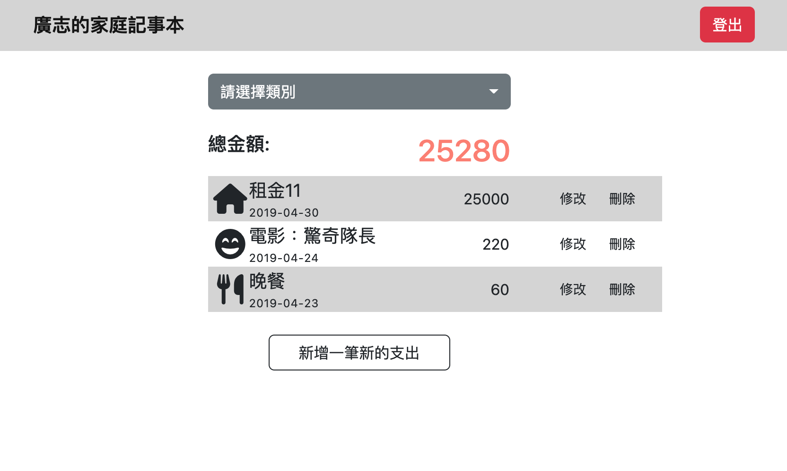

## Expense Tracker

### 功能介紹
- 提供會員註冊、登入功能，每位使用者有獨立的支出紀錄
- 查看目前已有紀錄的所有支出
- 新增新的支出
- 修改支出的資訊
- 將支出從紀錄中刪除
- 根據「類別」篩選支出
### 專案畫面

- 首頁


### 安裝

1. 透過終端機(Terminal)，先將此專案存放至本地位置

2. 在本地開啟之後，透過終端機進入資料夾，輸入：

   ```bash
   npm install // 安裝套件
   ```

3. 安裝完畢後，建立檔案.env，並設定環境變數(請參考.env.example)

4. 寫入種子資料
   ```bash
   npm run seed
   ```

5. 開啟程式
   ```bash
   npm run dev
   ```

4. 若看見以下訊息則代表順利運行，打開瀏覽器進入到以下網址

   ```bash
   Express is listening on localhost:3000
   mongodb connected!
   ```
   請至 http://localhost:3000 開啟網站
   
5. 若欲暫停使用

   ```bash
   ctrl + c
   ```

## 開發工具

- Node.js 10.15.0
- Express 4.18.2
- Express-Handlebars 4.0.2
- Bootstrap 5.2.2
- body-parser 1.20.1
- mongoose 5.9.7
- MongoDB
- method-override 3.0.0
- bcryptjs 2.4.3
- connect-flash 0.1.1 
- dotenv 16.0.3
- passport 0.4.1
- passport-local 1.0.0
- express-session 1.17.1
